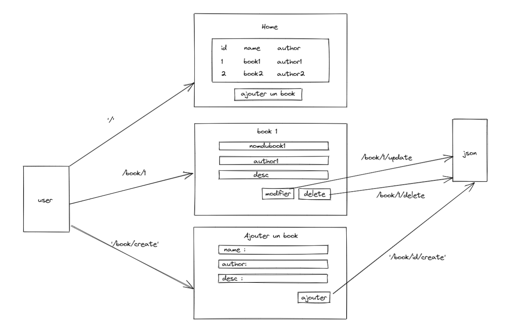

# 📚 ALEXANDRY

Alexandry library is a python server that handle the way we interact with their services. The server is a simple REST API.

## Explications

Fundamental methods such as GET, PUT, POST, and DELETE:

- GET for getting all books one by into the id.
- POST method, add a new book to the directory.
- PUT method, you can update the existing books.
- DELETE method, you can remove the books.

## Explanatory diagram

 


## ⚙ Installation

To retrieve the project:

```bash
git clone https://github.com/ElManchacho/efre-mdfs-python-alexandry.git
```

For this projet we use [Flask](https://flask.palletsprojects.com/en/2.0.x/)

For this project we use librairies like :

- We use flask :

```bash
pip install flask
```

or

```bash
py -m pip install flask
```

- We use [GetUI](https://getuikit.com/)

## 📞 License

Author : 

[Paul](https://github.com/ElManchacho)

[Sami]()

[Paul C](https://github.com/PaulCollas)

Projet pédagogique pour MDFS - Efrei Paris